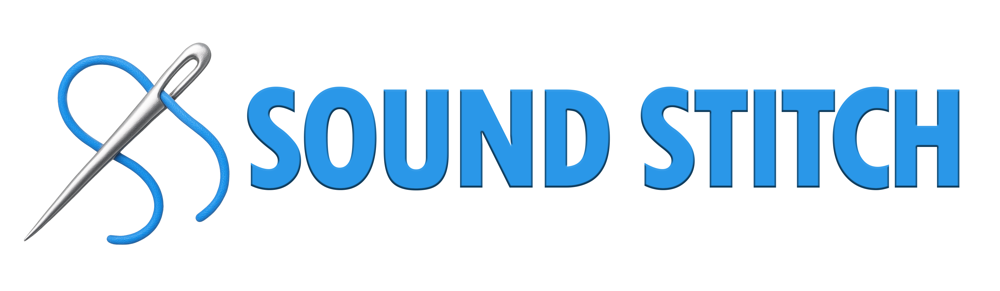

# Sound Stitch

> ⚠️ **PRE-RELEASE SOFTWARE** - Sound Stitch is currently in active development and not yet ready for production use. Features may be incomplete, unstable, or subject to significant changes.

**A specialized audio tool for seamless sample organization and non-destructive audio concatenation**

Sound Stitch addresses a fundamental gap in modern Digital Content Creation (DCC) workflows: the need for fast, intelligent, and non-destructive audio file joining (concatenation) that respects your existing sample organization.

## 🚀 **Getting Started**

### **Prerequisites**

Before running Sound Stitch, ensure you have the following installed:

1. **Node.js** (v18 or higher)
   - Download from [nodejs.org](https://nodejs.org/)
   - Verify installation: `node --version`

2. **Rust** (latest stable)
   - Install via [rustup.rs](https://rustup.rs/)
   - Verify installation: `rustc --version`

3. **pnpm** (package manager)
   - Install globally: `npm install -g pnpm`
   - Verify installation: `pnpm --version`

### **Installation & Setup**

1. **Clone the repository**
   ```bash
   git clone https://github.com/yourusername/sound-stitch.git
   cd sound-stitch
   ```

2. **Install dependencies**
   ```bash
   pnpm install
   ```

3. **Build and run in development mode**
   ```bash
   pnpm tauri dev
   ```

   This will:
   - Compile the Rust backend
   - Start the SvelteKit frontend
   - Launch the Tauri application window

### **Building for Production**

To create a distributable build:

```bash
pnpm tauri build
```

The built application will be available in `src-tauri/target/release/bundle/`

### **Platform-Specific Notes**

#### **Windows**
- Visual Studio Build Tools required for Rust compilation
- Windows 10/11 recommended

#### **macOS**
- Xcode Command Line Tools required: `xcode-select --install`
- macOS 10.15+ recommended

#### **Linux** (experimental)
- Additional system dependencies may be required
- Refer to [Tauri prerequisites](https://tauri.app/v1/guides/getting-started/prerequisites)


## 🎯 **The Problem**

While samples remain a cornerstone of modern music production and sound design, working with them in traditional DAWs involves frustrating limitations:

- **Destructive workflows** that permanently alter your source files
- **Disconnected browsing** - audio joining is separate from file exploration
- **Manual alignment** - clips must be manually positioned next to each other
- **Limited encoding control** over the final joined audio
- **Slow iteration** without real-time preview capabilities
- **Unwanted processing** like time-stretching or beat-matching

## **The Sound Stitch**

Sound Stitch reimagines audio joining as a **non-destructive, folder-based workflow** that aligns with how you already organize samples on your system.

### **Features**
- **Real-time audio preview** of combined sequences before export
- **Folder-based organization** - groups naturally map to your existing file structure
- **Automatic clip alignment** - no manual positioning required
- **Non-destructive workflow** - source files remain untouched
- **Adaptive timeline** that adjusts to your combined audio length
- **Fine-grained export control** with multiple format options

### **Export Formats**
- FLAC, AIFF, WAV, and MP3
- Customizable encoding parameters
- Batch processing capabilities

## 👥 **Use Cases**

### **Sound Designers & Musicians**
- Quickly audition and combine samples from large libraries
- Create seamless audio sequences for film, games, or music
- Generate variations and alternate versions non-destructively

### **Audio Engineers**
- Generate test audio sequences for equipment testing
- Create reference materials and audio examples
- Build custom audio content for technical documentation

### **Podcasters & Content Creators**
- Combine multiple takes into seamless segments
- Create audio snippets and highlights from longer recordings
- Build intro/outro sequences from component elements

## **Tech Stack**

**Built with Tauri + Rust + SvelteKit** for optimal performance:
- **Rust backend** handles intensive audio processing and file operations
- **Web-based UI** provides rich visual feedback and intuitive interaction
- **Native file system integration** for seamless local file browsing and management

The real-time combined audio preview system allows you to hear exactly how your sequence will sound before committing to an export - something traditional DAWs struggle to provide efficiently.

## **Workflow**

Sound Stitch complements rather than replaces your existing DAW workflow. It excels in the specific niche of **sample exploration, auditioning, and intelligent joining** - areas where traditional DAWs are often cumbersome or slow.

Think of it as a specialized tool that sits between your file browser and your DAW, making the journey from scattered audio files to cohesive sequences faster and more intuitive.


---

**Sound Stitch aims to be a focused, open-source tool that serves the audio community by doing one thing exceptionally well: making audio joining as intuitive as organizing files in folders.**

## 🗺️ **Development Roadmap**

### **Phase 1: Core Foundation** (Current)
- [x] Basic audio file loading and preview
- [x] Folder-based sample organization
- [x] Real-time waveform visualization and concatenation
- [x] Custom drag-and-drop ordering system
- [x] Stable audio concatenation and playback
- [x] Timeline seeking and progress tracking
- [x] Export functionality (WAV, FLAC, MP3)
- [x] Interactive sorting based on file metadata 

### **Phase 2: Enhanced User Experience**
- [x] Drag and drop manual re-ordering of samples 
- [ ] Keyboard shortcuts and accessibility features
- [ ] Performance optimizations for large sample libraries
- [x] Timeline improvements 

### **Phase 3: Advanced Features**
- [ ] Batch processing capabilities
- [ ] Basic audio effects (gain, fade, trim)
- [ ] Basic procedural concatenation FX (Random selection, select by regex) 
- [ ] Memory usage optimization for extremely large files
- [ ] Auto updates


---

### Current UI


