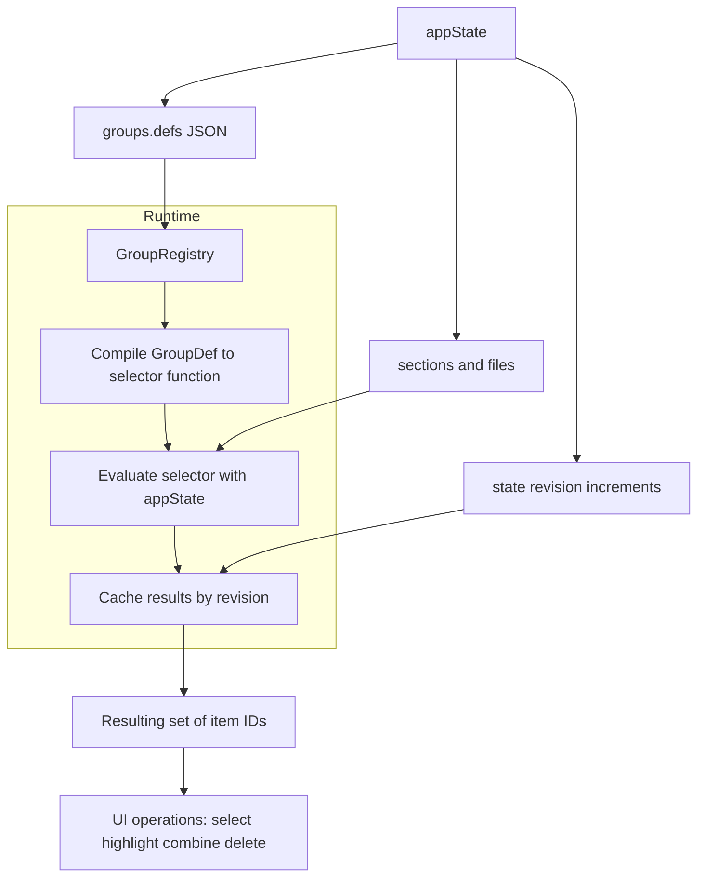

# Grouping system (Houdini-style) for `appState`

In Houdini, a **group** isn’t “a stored list of points” — it’s a **rule** (an expression) that decides _which_ points belong to the group _right now_.

We’re doing the same thing in TypeScript:

- A **Group** is a **named selection rule**.
- The rule is stored in `appState` as **plain JSON data** (because functions can’t be serialized).
- A **GroupRegistry** lives in code and **compiles** those JSON rules into real functions at runtime.
- When `appState` changes, groups naturally “update” because the registry re-evaluates them.

This gives you “Houdini group expressions” with persistence, composition, and good performance.

---

## The key idea: “Groups are predicates over your universe”

Your “geometry” is basically:

- `appState.sections[*].files[*]` (all `AudioFileItem`s)

So the universe is:

- **All file items across all sections**
- Groups produce **a Set of `AudioFileItem.id`**

That’s important:

- **IDs are stable**
- **Sets are fast**
- It’s easy to apply a group to UI operations (highlight, delete, sort, combine, etc.)

---

## Why we store a DSL / AST instead of functions

You want to serialize group state into `appState`.  
But functions like `(f) => f.active` cannot be JSON stringified safely.

So we store a **GroupDef** (a small declarative “recipe”) instead:

Examples:

- “50% of section 0”
- “last item across all sections”
- “active items”
- “(active) AND (half_of_section_0 OR last_global)”

These group defs are JSON and persist cleanly in your existing `persisted('appState', ...)`.

---

## The architecture

### 1) `appState.groups.defs`: serialized group definitions (JSON)

This is your saved “Houdini group expression” library.

Example mental model:

- `sec0_half` → **query**
- `global_last` → **query**
- `half_or_last` → **or** of the above
- `combo` → **and** with some other group

### 2) `GroupRegistry`: runtime engine

The registry is responsible for:

- Finding `GroupDef` by name
- Compiling it into a selector function `(state) => Set<id>`
- Evaluating groups on-demand
- Caching results by `_rev` (a monotonic “content revision”)

### 3) `_rev`: “geometry changed” revision number

This is the Houdini equivalent of “the SOP graph cooked again”.

Any time your sections/files change, bump `_rev`.
The registry uses `_rev` to decide whether cached group membership is still valid.

---

## “Groups can be grouped” (two meanings)

### A) Semantic grouping (real math)

A group can reference other groups:

- `and`, `or`, `not`
- This is _true_ “groups of groups” — group membership is defined in terms of other groups.

Example:

- `combo = active_only AND (sec0_half OR global_last)`

### B) UI grouping (organization only)

Sometimes you just want folders like Houdini’s group lists.
That can be saved as:

- `appState.groups.folders: Record<string, string[]>`

This does not affect selection logic — it’s purely UI organization.

---

## Example definitions (intuitive)

### “50% of items in section 0”

Interpretation:

- Sort section 0 files by `index`
- Take the first `floor(n * 0.5)`

Stored as:

- `query: { kind: "sectionPercent", sectionIndex: 0, percent: 0.5, take: "first" }`

### “Last item in all sections”

Interpretation:

- Look at all files across all sections
- Choose the file with max `index` (or “last array element”, depending on your chosen semantics)

Stored as:

- `query: { kind: "lastOfAllSections" }`

### Compose them

- `half_or_last = sec0_half OR global_last`
- `combo = active_only AND half_or_last`

---

## Mermaid diagram



---

## Cache Invalidation & Stale Selector Problem

The GroupRegistry uses two levels of caching for performance:

1. **Result Cache** (`this.cache`) - Stores evaluated group results by revision number
2. **Compiled Selector Cache** (`this.compiled`) - Stores pre-compiled selector functions

### The Critical Fix: Clearing Both Caches

When group definitions change (e.g., user updates a `sectionPercent` from 0.5 to 0.8), **both** caches must be cleared:

```typescript
invalidateAll() {
  this.cache.clear();        // ✅ Clear cached results
  this.compiled.clear();     // ✅ CRUCIAL: Clear compiled selectors too!
}
```

### Why Compiled Selectors Must Be Cleared

The compiled selectors capture query parameters at compile time through **closure capture**:

```typescript
// When compiled, parameters get "baked in":
const selector = (state) => runQuery(state, { 
  kind: 'sectionPercent', 
  percent: 0.5  // ❌ This was captured and wouldn't change
});
```

### The Bug That Was Fixed

**BEFORE (broken flow):**

1. User changes percent 0.5 → 0.8 in GroupParams UI
2. `patchGroupQuery()` updates `appState.groups.defs` and bumps `_rev`
3. Revision change triggers `invalidateAll()`
4. ❌ Only `this.cache.clear()` - compiled selector with 0.5 remains
5. Next evaluation uses stale compiled selector with 0.5
6. **Wrong results** - UI shows 0.8 but evaluation uses 0.5

**AFTER (fixed flow):**

1. User changes percent 0.5 → 0.8 in GroupParams UI
2. `patchGroupQuery()` updates `appState.groups.defs` and bumps `_rev`
3. Revision change triggers `invalidateAll()`
4. ✅ Both `this.cache.clear()` AND `this.compiled.clear()`
5. Next evaluation calls `getOrCompile()` - no compiled selector exists
6. Fresh selector compiled with new 0.8 value from current appState
7. **Correct results** - evaluation matches UI parameters

### Parameter Update Workflow

```mermaid
┌─────────────────┐    ┌──────────────────┐    ┌─────────────────┐
│   User Changes  │───▶│  patchGroupQuery │───▶│  State Updated  │
│  Param in UI    │    │     Called       │    │   _rev Bumped   │
└─────────────────┘    └──────────────────┘    └─────────────────┘
                                                        │
                                                        ▼
┌─────────────────┐    ┌──────────────────┐    ┌─────────────────┐
│ Fresh Selector  │◀───│  getOrCompile    │◀───│ invalidateAll() │
│   Compiled      │    │   (cache miss)   │    │  Clears BOTH    │
└─────────────────┘    └──────────────────┘    └─────────────────┘
        │                                               │
        ▼                                               ▼
┌─────────────────┐    ┌──────────────────┐    ┌─────────────────┐
│ runQuery with   │───▶│   Correct        │    │   Cache Miss    │
│ NEW Parameters  │    │   Results        │    │  (as expected)  │
└─────────────────┘    └──────────────────┘    └─────────────────┘
```

### Key Insight: Stale Closures in Caching Systems

This was a classic **stale closure** problem. The compiled selectors were capturing query parameters at compile time, creating closures that wouldn't see parameter updates. The solution is to invalidate compiled selectors whenever the underlying definitions change, forcing fresh compilation with updated parameters.

### Performance Notes

- **Result caching** is still effective for unchanged groups
- **Compiled selector caching** is still beneficial for repeated evaluations
- The fix ensures **correctness** without sacrificing performance for the common case
- Only groups with changed definitions get recompiled

---
